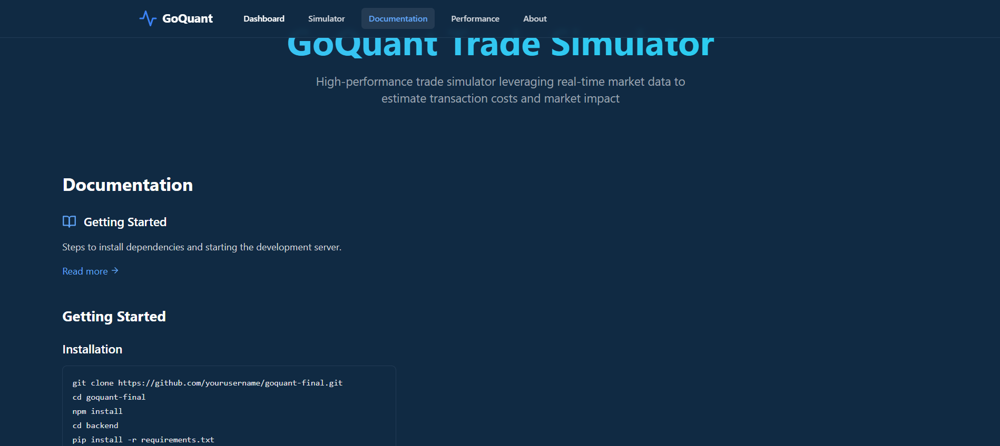
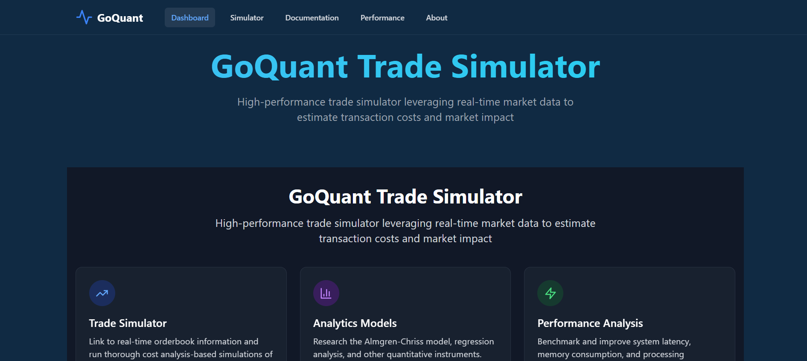

# 1. Project Overview

 One excellent trading simulation tool is GoQuant Trade Simulator, which does the following:

* calculates transaction costs by processing real-time market data.
* determines the impact on the market.
* offers sophisticated analytics
* Responsive for all screens.

 # 1.1. Key Features
* Real-time orderbook data processing
* Almgren-Chriss model implementation
* Interactive user interface
* Performance monitoring
* WebSocket integration

# 2. Technical Architecture

**Frontend Stack**

- React 18 with TypeScript
- Vite for build tooling
- GSAP for animations
- TailwindCSS for styling
- Chart.js for visualizations

**Backend Stack**

- Python Flask
- WebSockets for real-time data
- NumPy for calculations
- Asyncio for async operations

# 3. Core Components

**Market Impact Model**

def calculate_market_impact(quantity, volatility, mid_price, depth):
    """
    Almgren-Chriss model implementation
    I(v) = σ × |v| × √(T/V) × P
    where:
    - σ: volatility
    - v: order size
    - T: time horizon
    - V: volume
    - P: price
    """
    time_horizon = 1
    volume = depth
    impact = volatility * abs(quantity) * np.sqrt(time_horizon / volume)
    return impact * 100

# 4.  Implementation Details

  **Real-time Data Processing**

   async def connect_to_okx():
    """Establishes WebSocket connection to OKX exchange"""
    uri = "wss://ws.gomarket-cpp.goquant.io/ws/l2-orderbook/okx/BTC-USDT-SWAP"
    async with websockets.connect(uri) as websocket:
        while True:
            message = await websocket.recv()
            process_data(message)

# 5. Algorithmic Trading Concepts

  **Slippage Calculation**

def calculate_slippage(quantity, market_depth, volatility):
    """
    Calculate expected slippage based on:
    - Order quantity
    - Market depth
    - Asset volatility
    """
    relative_size_impact = quantity / (market_depth + 1)
    return relative_size_impact * volatility * 100

# 6. Setup and Installation

# Frontend setup
cd frontend
npm install
npm run dev

# Backend setup
cd backend
pip install -r requirements.txt
python app.py

